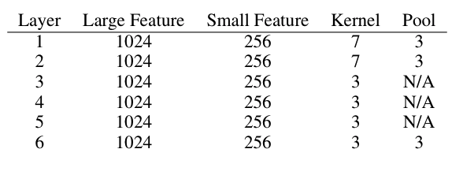
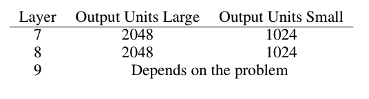
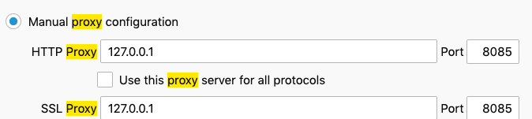

# DJL Malicious URL Detector Model Demo

## Introduction

This repository contains a Demo application built using [Deep Java Library(DJL)](https://github.com/awslabs/djl). The application detects malicious urls based on a trained [Character Level CNN model](https://arxiv.org/abs/1509.01626).

It uses a third-party dataset that is a amalgamation of the following malicious URL databases:

Benign

1. Custom automated webscraping of Alexa Top 1M with recursive depth of scraping of level 1

Malicious

1. Various blacklists
2. openphish
3. phishtank
4. Public GitHub faizann24
5. Some custom entries

The dataset can be found in the [Malicious-URL-Detection-Deep-Learning repository](https://github.com/incertum/cyber-matrix-ai/tree/master/Malicious-URL-Detection-Deep-Learning).

## Model architecture

The model has the following architecture:

```
  (0): Conv1D(None -> 256, kernel_size=(7,), stride=(1,))
  (1): MaxPool1D(size=(3,), stride=(3,), padding=(0,), ceil_mode=False)
  (2): Conv1D(None -> 256, kernel_size=(7,), stride=(1,))
  (3): MaxPool1D(size=(3,), stride=(3,), padding=(0,), ceil_mode=False)
  (4): Conv1D(None -> 256, kernel_size=(3,), stride=(1,))
  (5): Conv1D(None -> 256, kernel_size=(3,), stride=(1,))
  (6): Conv1D(None -> 256, kernel_size=(3,), stride=(1,))
  (7): Conv1D(None -> 256, kernel_size=(3,), stride=(1,))
  (8): MaxPool1D(size=(3,), stride=(3,), padding=(0,), ceil_mode=False)
  (9): Flatten
  (10): Dense(None -> 1024, Activation(relu))
  (11): Dropout(p = 0.5)
  (12): Dense(None -> 1024, Activation(relu))
  (13): Dropout(p = 0.5)
  (14): Dense(None -> 2, linear)

```
There are 2 output classification labels, benign or malicious.

The general model structure is based on the [Character level CNNs paper's](https://arxiv.org/abs/1509.01626) model description.

 



## Running the Proxy Server to detect malicious URLs

This demo contains a simple proxy server that can work with browsers to detect malicious URLs. This demo acts as a filter for malicious URLs. It works with both HTTP and HTTPs requests.

To run the example, copy the pre-trained parameters file under the [parameters directory](trained_parameters) to the ``` src/main/resources``` directory using the following commands:

```bash
# Copy pre-trained parameters for inference
$ mkdir -p src/main/resources
$ cp trained_parameters/*.params src/main/resources/
```

Select the MXNet backend for your operating system in the ```build.gradle``` file as follows:

```groovy
//Mac runtime
runtime "ai.djl.mxnet:mxnet-native-mkl:1.6.0-a:osx-x86_64"
// Linux runtime
runtime "ai.djl.mxnet:mxnet-native-mkl:1.6.0-a:linux-x86_64"
//Edit the Gradle file to select one
```

Run the proxy server using the following command in your terminal:

```bash
$ ./gradlew run
```
This command starts the serve, listening at port 8080.
```bash
> Task :run
[main] INFO com.example.FilterProxy - Waiting for request(s) on port 8080
```
In your browser settings (firefox, for example), set the proxy settings to 127.0.0.1:8080.



Now you can try to navigate to a mispelled amazon.com URL in the browser navigator and see the proxy at work.


The proxy server prints the following on the terminal screen:
```bash
> Task :run
[main] INFO com.example.FilterProxy - Waiting for client on port 8080..
[Thread-1] INFO com.example.RequestHandler - Malicious URL detected and blocked http://amazom.com/
```

Typing the correct URL should show the correct website as follows:
    

## Train the model in the command line

To train the model, a GPU instance is recommended. Training with a CPU is very slow compared to training with a GPU.

In the ```build.gradle``` file, enable the MXNet GPU runtime as follows:

```groovy
runtime "ai.djl.mxnet:mxnet-native-cu101mkl:1.6.0-a:linux-x86_64"
//comment out the CPU runtime
```
Create a ```resources``` folder and download the dataset using the following commands:
```bash
$ mkdir -p src/main/resources
$ wget -O src/main/resources/malicious_url_data.csv https://raw.githubusercontent.com/incertum/cyber-matrix-ai/master/Malicious-URL-Detection-Deep-Learning/data/url_data_mega_deep_learning.csv
```

Train the model using the following command:

```bash
$./gradle train

> Task :train
[main] INFO com.example.ModelTrainer - Loading Dataset
[main] INFO com.example.ModelTrainer - Initialize Trainer
[main] INFO com.example.ModelTrainer - Loading Dataset
[main] INFO com.example.ModelTrainer - Initialize Trainer
[12:45:09] src/operator/nn/./cudnn/cudnn_pooling-inl.h:375: 1D pooling is not supported by cudnn, MXNet 1D pooling is applied.
[main] INFO com.example.ModelTrainer - Begin Training
[12:45:09] src/operator/nn/./cudnn/./cudnn_algoreg-inl.h:97: Running performance tests to find the best convolution algorithm, this can take a while... (set the environment variable MXNET_CUDNN_AUTOTUNE_DEFAULT to 0 to disable)
Training:    100% |████████████████████████████████████████| accuracy: 0.71 loss: 0.54 speed: 323.74 urls/sec
Validating:  100% |████████████████████████████████████████|
[main] INFO com.example.ModelTrainer - Epoch 0 finished.
[main] INFO com.example.ModelTrainer - train accuracy: 0.7131701, train loss: 0.5386256
[main] INFO com.example.ModelTrainer - validate accuracy: 0.89068836, validate loss: 0.30017522
Training:     15% |███████                                 | accuracy: 0.90 loss: 0.26 speed: 383.75 urls/sec
Training:    100% |████████████████████████████████████████| accuracy: 0.92 loss: 0.21 speed: 336.71 urls/sec
Validating:  100% |████████████████████████████████████████|
[main] INFO com.example.ModelTrainer - Epoch 1 finished.
[main] INFO com.example.ModelTrainer - train accuracy: 0.91614103, train loss: 0.21319388
[main] INFO com.example.ModelTrainer - validate accuracy: 0.81641084, validate loss: 0.43587697
Training:    100% |████████████████████████████████████████| accuracy: 0.95 loss: 0.14 speed: 340.42 urls/sec
Validating:  100% |████████████████████████████████████████|
[main] INFO com.example.ModelTrainer - Epoch 2 finished.
[main] INFO com.example.ModelTrainer - train accuracy: 0.9457474, train loss: 0.14361516
[main] INFO com.example.ModelTrainer - validate accuracy: 0.89394796, validate loss: 0.26676258
Training:    100% |████████████████████████████████████████| accuracy: 0.96 loss: 0.11 speed: 339.22 urls/sec
Validating:  100% |████████████████████████████████████████|
[main] INFO com.example.ModelTrainer - Epoch 3 finished.
[main] INFO com.example.ModelTrainer - train accuracy: 0.9595303, train loss: 0.10922413
[main] INFO com.example.ModelTrainer - validate accuracy: 0.9005698, validate loss: 0.26299196
Training:    100% |████████████████████████████████████████| accuracy: 0.97 loss: 0.09 speed: 338.12 urls/sec
Validating:  100% |████████████████████████████████████████|
[main] INFO com.example.ModelTrainer - Epoch 4 finished.
[main] INFO com.example.ModelTrainer - train accuracy: 0.9665886, train loss: 0.08993893
[main] INFO com.example.ModelTrainer - validate accuracy: 0.85562855, validate loss: 0.38608122
Training:    100% |████████████████████████████████████████| accuracy: 0.97 loss: 0.07 speed: 292.06 urls/sec
Validating:  100% |████████████████████████████████████████|
[main] INFO com.example.ModelTrainer - Epoch 5 finished.
[main] INFO com.example.ModelTrainer - train accuracy: 0.97365975, train loss: 0.07207036
[main] INFO com.example.ModelTrainer - validate accuracy: 0.92241156, validate loss: 0.22621335
Training:    100% |████████████████████████████████████████| accuracy: 0.98 loss: 0.06 speed: 319.64 urls/sec
Validating:  100% |████████████████████████████████████████|
[main] INFO com.example.ModelTrainer - Epoch 6 finished.
[main] INFO com.example.ModelTrainer - train accuracy: 0.9785428, train loss: 0.05851153
[main] INFO com.example.ModelTrainer - validate accuracy: 0.9198193, validate loss: 0.2653344       
```

To run inference again, copy the ```.params``` file to the ```src\main\resources\``` folder.

## More Reading

This repository contains documentation on training the model using DJL, writing Datasets, and using Translators.

1. [Creating a CSV Reading Dataset](docs/dataset_creation.md)
2. [Defining the Character-level CNN Imperative Model](docs/define_model.md)
3. [Training the Character-level CNN Model on a CSV Dataset](docs/training_model.md)
4. [Writing Translators](docs/translators.md)

## License

This project is licensed under the Apache-2.0 License.


