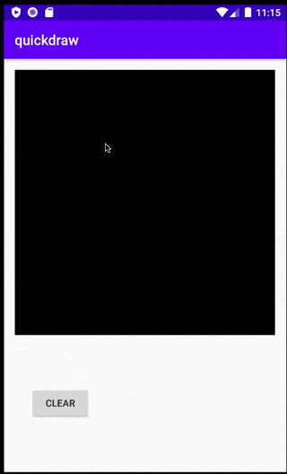
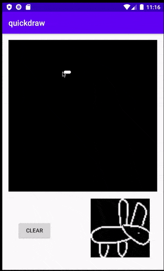

# DoodleDraw recognition

Rabbit                     |  Cat                      | banana
:-------------------------:|:-------------------------:|:-------------------------:
     |        | 

[Quickdraw dataset](https://github.com/googlecreativelab/quickdraw-dataset) were created by Google
that includes millions of hand-drawn doodle. The model were trained through
the subset from [kaggle challenge](https://www.kaggle.com/c/quickdraw-doodle-recognition).

Model were trained with MobileNet on PyTorch and achieved 91.7% top 3 accuracy.
This application demos how user can import PyTorch model and run inference on their device.

The minimum API level for this project is 26.

### Setup
Use the following command to install this app on your Android phone:

```
cd quickdraw_recognition

# for Linux/macOS
./gradlew iD

# for Windows
..\gradlew iD
```

It will install the doodle_draw application on your Android phone.
