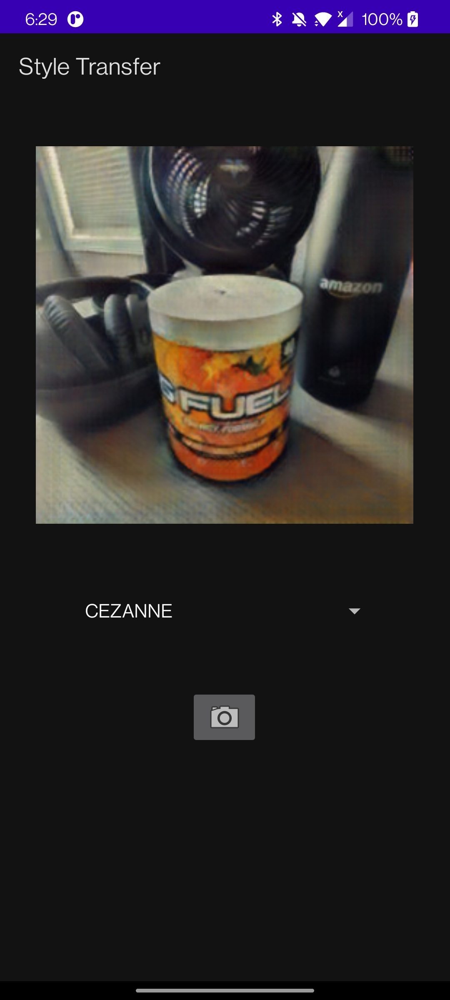
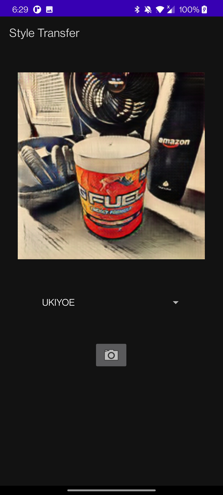
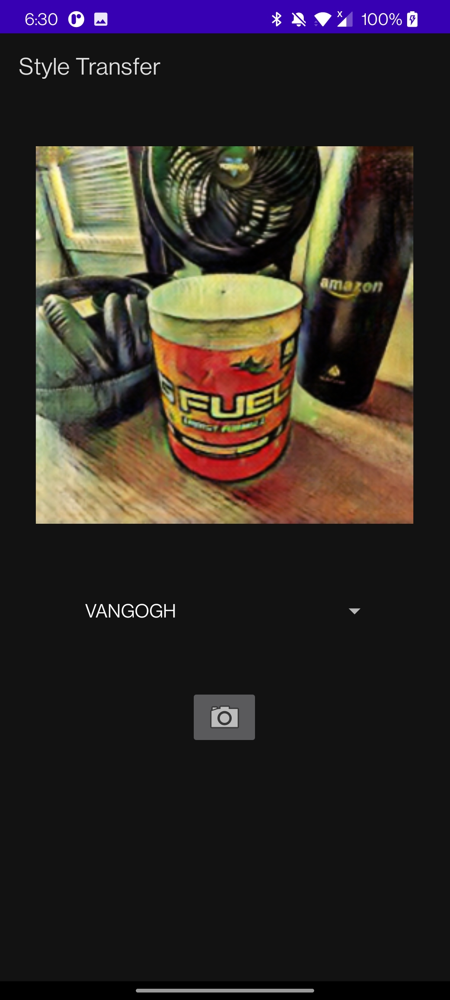

# DJL Android Demo

# Introduction
In this example, you will learn how to do style transfer with pre-trained CycleGAN models. You will transform regular images into a painting by a famous artist. The supported artists are Cezanne, Monet, Ukiyoe and Vangogh.

## Style Transfer

Cezanne          |  Monet            | Ukiyoe        |  Vangogh       
:--------------:|:-----------------:|:----------------:|:--------------:
        |           |         |           

The minimum API level for this project is 26.

### Setup

Run the project through Android Studio on your android device. To do this, connect your android phone to your computer and make sure USB Debugging is enabled in Developer Options. Android Studio should automatically detect your device. 