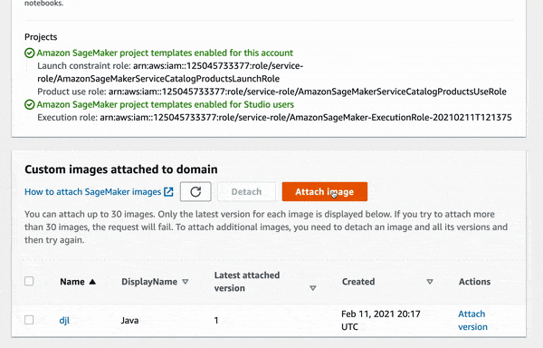

# Use DJL notebook with SageMaker studio

Amazon SageMaker Studio provides a single, web-based visual interface where you can perform all ML development steps, improving data science team productivity by up to 10x. SageMaker Studio gives you complete access, control, and visibility into each step required to build, train, and deploy models. DJL offers a rich functionalities to integrate with SageMaker services that allows you to do all kinds of training/inference and deployment works.

## Setup

### Build/Pull docker image

In this folder, you can find a [Dockerfile](Dockerfile) that allows you to build an image that can work along with SageMaker Studio. You can use the following command to build the docker image:

```
docker build . -t sagemaker-djl
```

We also offers a [prebuilt image](https://hub.docker.com/r/deepjavalibrary/sagemaker) for it:

```
docker pull deepjavalibrary/sagemaker:cpu
```

### Push to ECR repo

Once you have the docker image, you can push it to your AWS Account's ECR repository. The best way to get the exact instruction is to use AWS Console and follow the instruction in ECR push.

Here are some sample steps:

Login:

```
aws ecr get-login-password --region <REGION> | docker login --username AWS --password-stdin <Account ID>.dkr.ecr.<REGION>.amazonaws.com
```

Tag the image:

```
docker tag deepjavalibrary/sagemaker:cpu <Account ID>.dkr.ecr.<REGION>.amazonaws.com/sagemaker:cpu
```

Push the image:

```
docker push <Account ID>.dkr.ecr.<REGION>.amazonaws.com/sagemaker:cpu
```


### Add the image to SageMaker Studio

Once you have done the previous two steps, you can just use SageMaker Studio console to "Attach Image" to add the custom image from the ECR. Since the image itself is pre-built with all default SageMaker settings, all you needs to do is to add a Java kernel from it. Type in the name "java" and display Name "Java" and you are good to go.


Here is a sample, assume I have a ECR repo called djl-sm.




## Start with SM Studio

After the setup, you can just launch with the custom image. Choose the Java kernel and start with a Java notebook.


