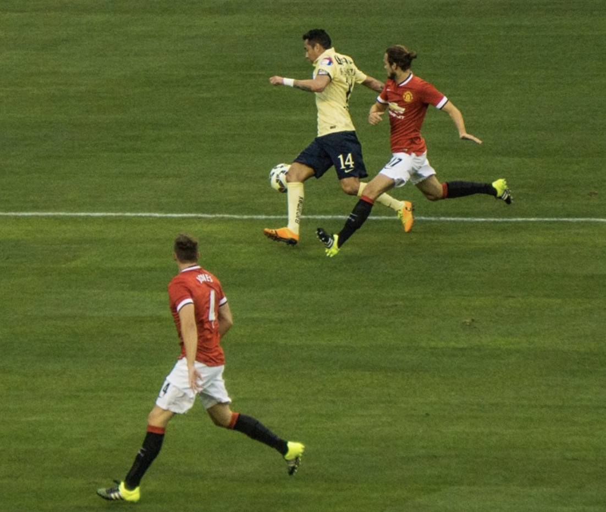
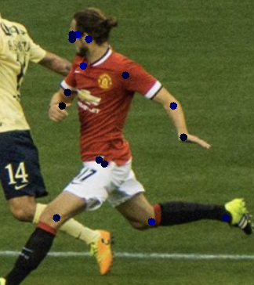

# MultiEngine on DJL

This is an example of how to run multiple engines in one Java process using DJL.

Why is it good to be able to run multiple engines in one Java process?

Many deep learning frameworks have their individual strength and weaknesses when doing training/inference
on different models. Some frameworks run certain models faster and being able to switch between what engines to use 
on what models gives the benefits of being able to utilize the strengths of each engine.

This example uses an image of soccer players, puts that through a PyTorch model to do object detection to get 
a player from the image, then feeds that resulting image to an MXNet model to do pose estimation. 

*Note:* Loading multiple deep learning engines will cause OpenMP to load multiple times, which may cause a slowdown
or memory errors to occur. [Here](performance_numbers.md) are the results of a few simple benchmarks that we ran.

## Setup
Go into the multi-engine directory and run the following command to build the project:

```
cd multi-engine

# for Linux/macOS:
./gradlew build

# for Windows:
..\gradlew build
```

## Run the MultiEngine Program

Run the following command to run the project:

```shell
# for Linux/macOS:
./gradlew run

# for Windows:
..\gradlew build
```

This will take the original image:



Use a object detection PyTorch model to extract the player and pass the result through an 
MXNet model to do pose estimation and give us the final image with the joints marked as shown below:



## Configurations and the Code

### Code

The main code loads the image in and calls the `detectPersonWithPyTorchModel` method where it will
load in the PyTorch model based on the filter parameters and detect a person from the image.
It will then crop the image where the person was detected and return that image.

Once we have the image of the person, we pass it to the next method `detectJointsWithMxnetModel` 
method where it loads the MxNet Model from model zoo based on the filter parameters to do joint detection 
on the image of the person. It will then output the result of the joints image to `build/output`.
