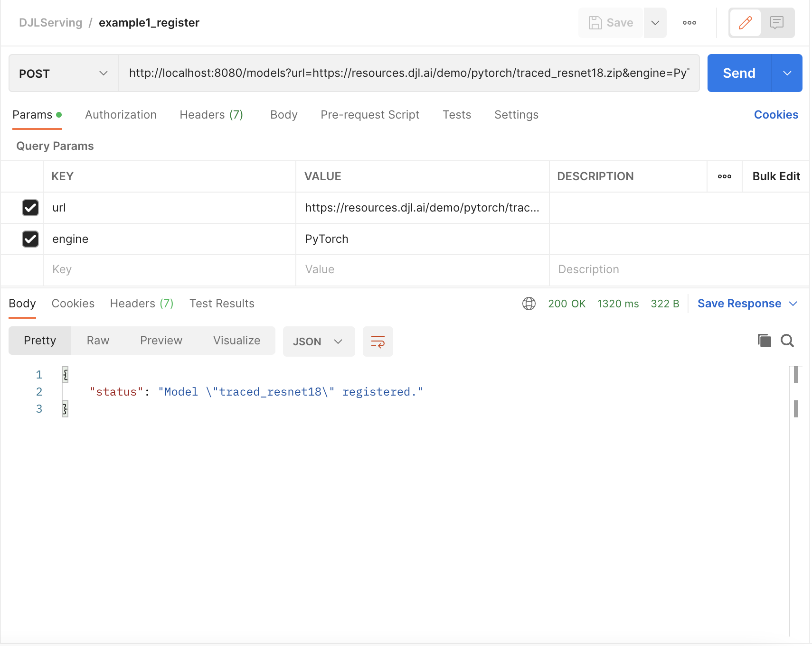
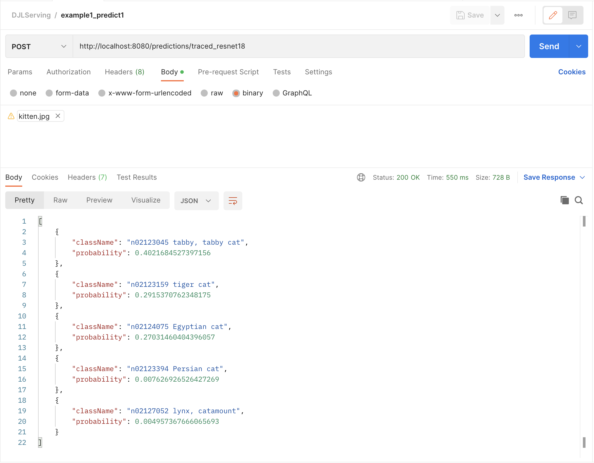
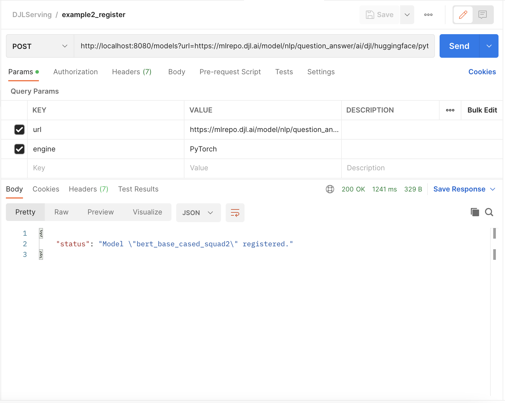
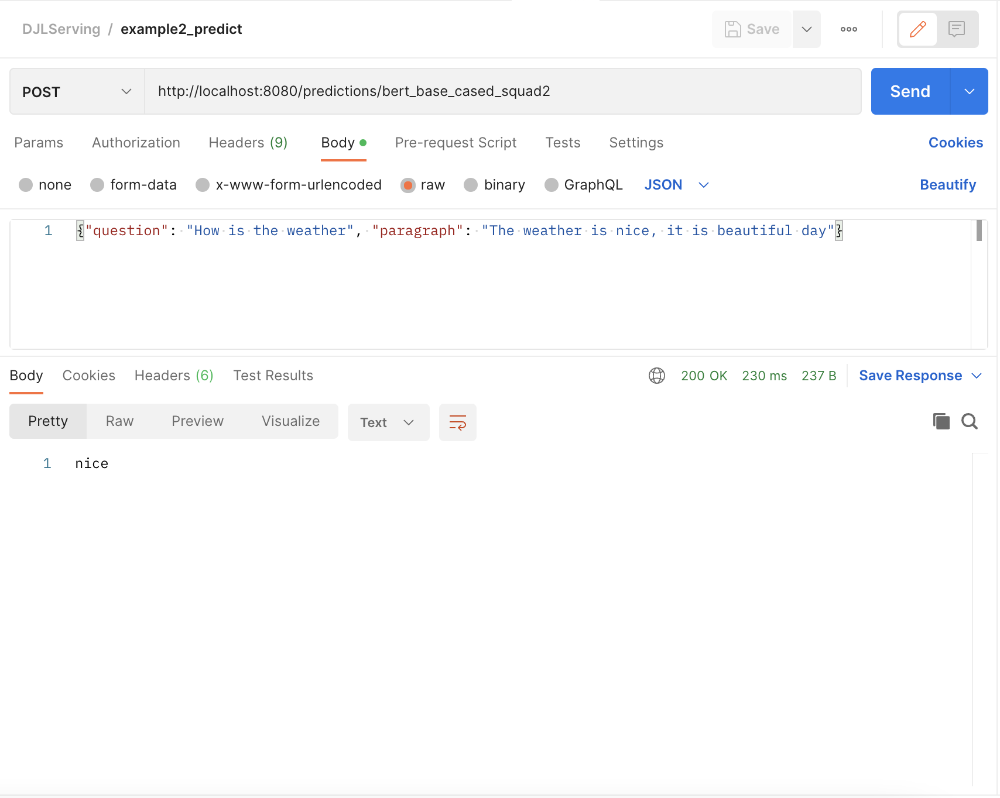
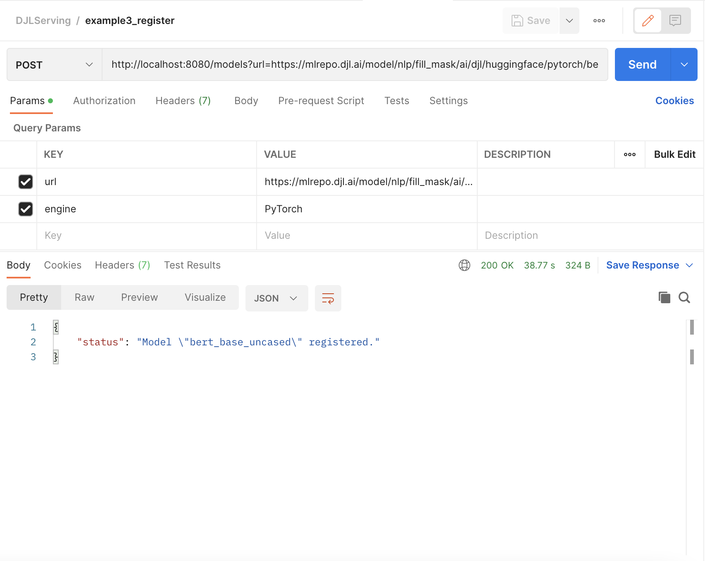
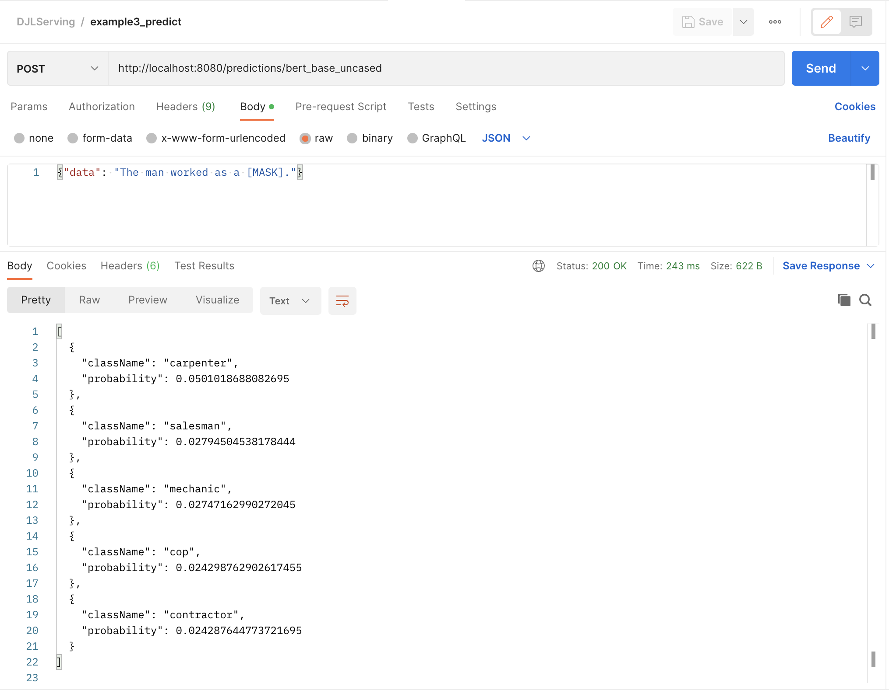

# DJLServing Postman Example

This demo project include several examples to demonstrate how to make inference requests against DJL Serving using [Postman](https://www.postman.com/).

Postman is a REST Client that can send requests, inspect responses, and make debugging REST APIs easier.

To import the example Postman collection:

1. Select **Import** in the left navigation menu of the Postman app.
2. Choose **Upload Files**, then choose the collection file.

Note that this demo assumes that DJLServing is already started. Refer [here](https://github.com/deepjavalibrary/djl-serving/blob/master/serving/docs/starting.md) on how to start DJL Serving.

## Example 1

In the first example, let's load an [Image Classification model](https://resources.djl.ai/demo/pytorch/traced_resnet18.zip).

First we need to download the input image.

```
cd /tmp
curl -O https://resources.djl.ai/images/kitten.jpg
```

To register the model, go to the Postman app, choose the **POST** method, enter the request URL as http://localhost:8080/models, fill in the `url` and `engine` Params, then click **Send**.



This is equivalent to:

```
curl -X POST "http://localhost:8080/models?url=https://resources.djl.ai/demo/pytorch/traced_resnet18.zip&engine=PyTorch"
```

Then we make predictions by entering the endpoint URL and choosing the **binary** body type.



This is equivalent to:

```
curl -X POST http://localhost:8080/predictions/traced_resnet18 -T /tmp/kitten.jpg
```

Or we can use **multipart/form-data** body type:


This is equivalent to:

```
curl -X POST http://localhost:8080/predictions/traced_resnet18 -F 'data=@"/tmp/kitten.jpg"'
```

## Example 2

In the second example, we load a [HuggingFace Bert QA model](https://mlrepo.djl.ai/model/nlp/question_answer/ai/djl/huggingface/pytorch/deepset/bert-base-cased-squad2/0.0.1/bert-base-cased-squad2.zip) and make predictions. Enter the information specified below to register model:



This is equivalent to:

```
curl -X POST "http://localhost:8080/models?url=https://mlrepo.djl.ai/model/nlp/question_answer/ai/djl/huggingface/pytorch/deepset/bert-base-cased-squad2/0.0.1/bert-base-cased-squad2.zip&engine=PyTorch"
```

Then we make predictions by enter the endpoint URL, add Content-Type header and choose the **raw** body type.



This is equivalent to:

```
curl -k -X POST http://localhost:8080/predictions/bert_base_cased_squad2 -H "Content-Type: application/json" \
    -d '{"question": "How is the weather", "paragraph": "The weather is nice, it is beautiful day"}'
```

## Example 3

In the third example, we try a [HuggingFace Fill Mask model](https://mlrepo.djl.ai/model/nlp/fill_mask/ai/djl/huggingface/pytorch/bert-base-uncased/0.0.1/bert-base-uncased.zip). Enter the information specified below to register model:



This is equivalent to:

```
curl -X POST "http://localhost:8080/models?url=https://mlrepo.djl.ai/model/nlp/fill_mask/ai/djl/huggingface/pytorch/bert-base-uncased/0.0.1/bert-base-uncased.zip&engine=PyTorch"
```

Then we make predictions by enter the endpoint URL, add Content-Type header and choose the **raw** body type.



This is equivalent to:

```
curl -X POST http://localhost:8080/predictions/bert_base_uncased -H "Content-Type: application/json" -d '{"data": "The man worked as a [MASK]."}'
```