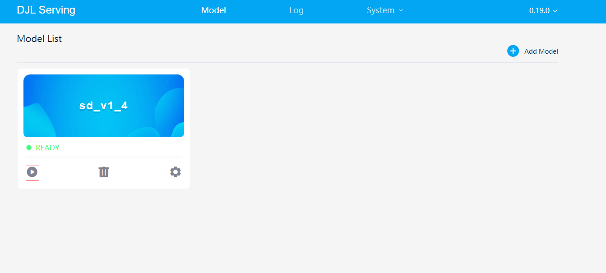
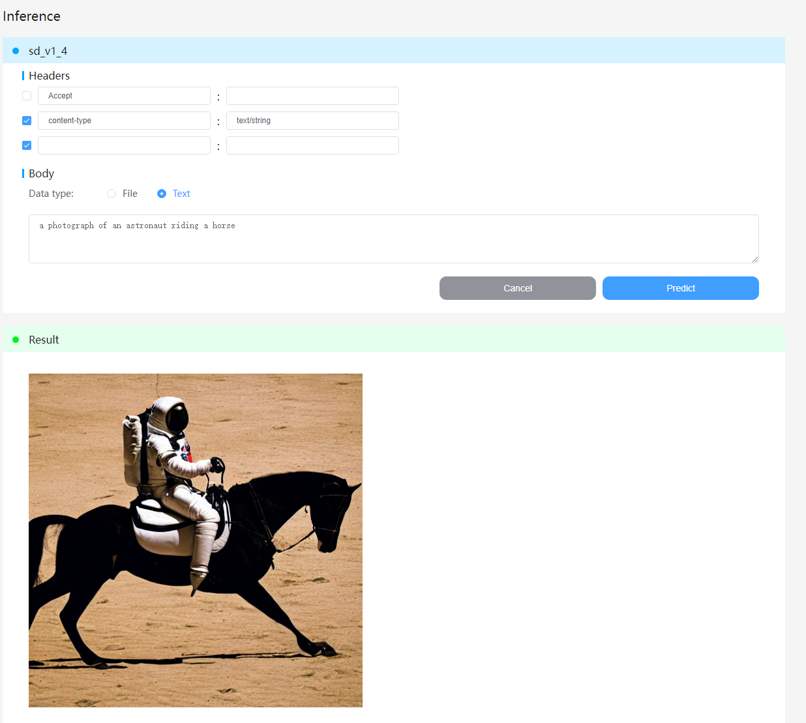
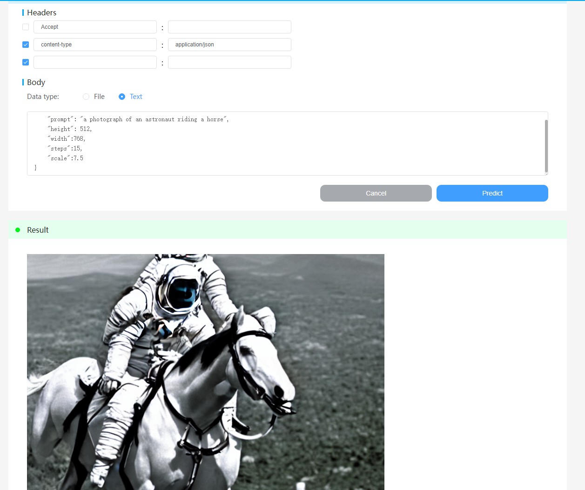
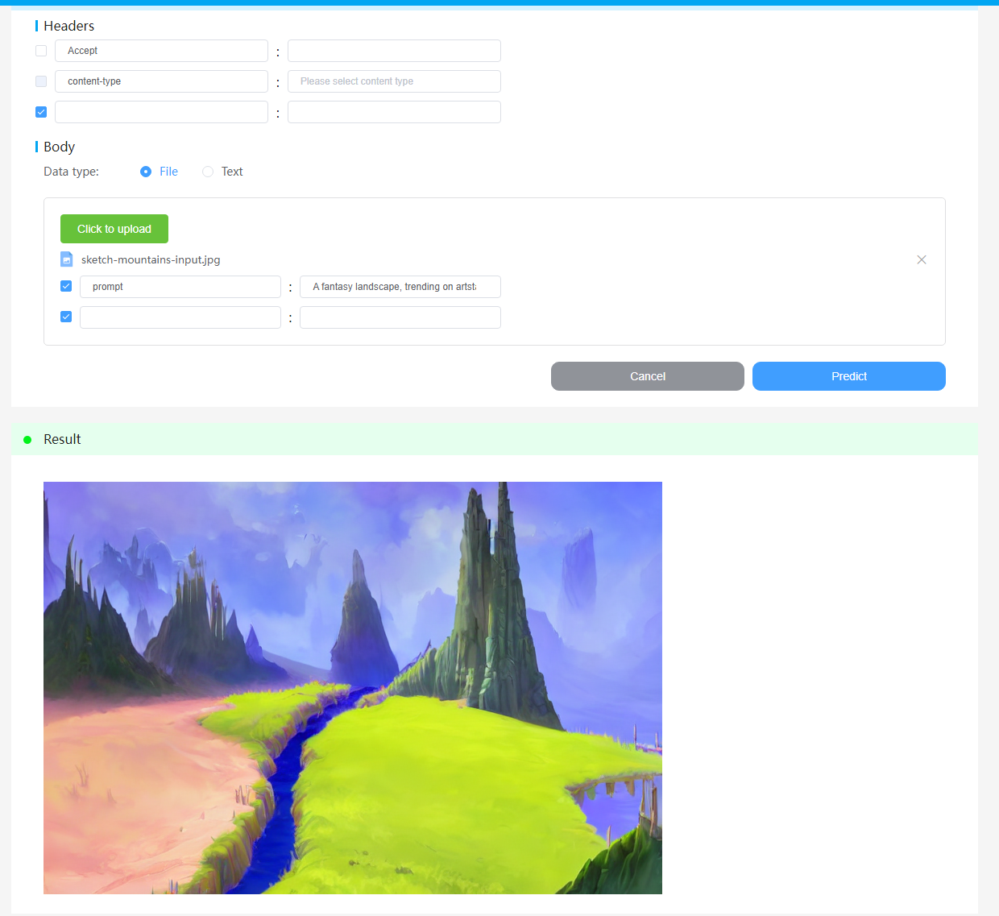

# djl-serving运行stable diffusion

建议使用docker环境的djl-serving运行stable diffusion，这样能省去很多环境上的配置操作。

## 拉取djl-serving的镜像
这里我们使用pytorch-cu113-nightly这个版本的docker镜像

### 拉取镜像

`docker pull deepjavalibrary/djl-serving:pytorch-cu113-nightly`

### 创建容器

`nvidia-docker run -itd --name serving1 -p 8080:8080 deepjavalibrary/djl-serving:0.19.0-pytorch-cu113`

如果你没有gpu环境，可以把**nvidia-docker**换成**docker**

### 安装stable diffusion环境

进入到docker容器内，选择一个目录存放stable diffusion源码，这里我选择djl-serving的模型存放目录/opt/ml/model

`docker exec -it serving1 /bin/bash`

下载stable diffusion模型和源码

由于模型较大，所以需要先安装git-lfs

`apt install git-lfs  -y`

把项目下载下来，这里需要token，自行到huggingface官网注册账号激活后，到**Settings**下的**Access Tokens**

创建

`git clone https://huggingface.co/CompVis/stable-diffusion-v1-4`

安装环境依赖

`pip install --upgrade diffusers transformers scipy`

### 准备Model Server代码
这里我们只需要两个文件，一个requirements.txt，添加stable diffusion依赖

```text
transformers
diffusers
```
在requirements.txt添加这两行即可

另一个就是model.py了，这里写上我们处理输入输出的逻辑
```python
import torch
from torch import autocast
from diffusers import StableDiffusionPipeline,StableDiffusionImg2ImgPipeline
from djl_python import Input, Output
import io
from PIL import Image
from io import BytesIO

textPipe = StableDiffusionPipeline.from_pretrained("/opt/ml/model/stable-diffusion-v1-4",revision="fp16", torch_dtype=torch.float16).to("cuda")
imgPipe = StableDiffusionImg2ImgPipeline.from_pretrained("/opt/ml/model/stable-diffusion-v1-4",revision="fp16", torch_dtype=torch.float16).to("cuda")

def handle(inputs: Input) -> Output:
    global textPipe
    global imgPipe
    if inputs.is_empty():
        return None
    content_type = inputs.get_property("content-type")
    if content_type == "application/json":
        param = inputs.get_as_json()
        prompt =param.get('prompt')
        height =param.get('height')
        width =param.get('width')
        steps =param.get('steps')
        scale =param.get('scale')
        with torch.autocast("cuda"):
            image = textPipe(prompt,guidance_scale=scale, num_inference_steps=steps,height=height, width=width)["sample"][0]
            buf = io.BytesIO()
            image.save(buf, format='PNG')
            byte_im = buf.getvalue()
            return Output().add(byte_im).add_property("content-type","image/png")
    elif content_type is not None and content_type.startswith("text/"):
        prompt =inputs.get_as_string()
        with torch.autocast("cuda"):
            image = textPipe(prompt)["sample"][0]
            buf = io.BytesIO()
            image.save(buf, format='PNG')
            byte_im = buf.getvalue()
            return Output().add(byte_im).add_property("content-type","image/png")
    else:
        init_image = Image.open(BytesIO(inputs.get_as_bytes())).convert("RGB")
        #init_image = Image.open(BytesIO(response.content)).convert("RGB")
        init_image = init_image.resize((768, 512))
        prompt =inputs.get_as_string(key="prompt")
        #prompt = "A fantasy landscape, trending on artstation"
        with torch.autocast("cuda"):
            image = imgPipe(prompt=prompt, init_image=init_image, strength=0.75, guidance_scale=7.5).images[0]
            buf = io.BytesIO()
            image.save(buf, format='PNG')
            byte_im = buf.getvalue()
            return Output().add(byte_im).add_property("content-type","image/png")
```

这里定义了两个pipe,一个textPipe用于文本转图片，一个imgPipe用于图片生成图片

处理输入报文时，对content-type做了个区分，text/*使用的是text2text的默认配置，只需传prompt即可，

application/json可自定义height、width、steps等参数

剩下的就是img2img了，需要上传一张图片，还有在form-data里传入prompt

### 以下是示例报文

默认参数text2text
```
curl --location --request POST 'http://your server:8080/predictions/sd_v1_4/' \
--header 'content-type: text/string' \
--data-raw 'a photograph of an astronaut riding a horse'
```
自定义参数text2text
```
curl --location --request POST 'http://your server:8080/predictions/sd_v1_4/' \
--header 'Content-Type: application/json' \
--data-raw '{
    "prompt": "a photograph of an astronaut riding a horse",
    "height": 512,
    "width":768,
    "steps":15,
    "scale":7.5
}'
```

img2img
```
curl --location --request POST 'http://your server:8080/predictions/sd_v1_4/' \
--form 'data=@"/C:/Users/Administrator/Desktop/sketch-mountains-input.jpg"' \
--form 'prompt="A fantasy landscape, trending on artstation"'
```
当然，你也可以通过djl-serving自带的控制台发送上面的请求



通过"http://your server:8080/console"进入控制台，从主页的Model List 找到模型，进入模型推理界面

默认参数text2text



自定义参数text2text



img2img


